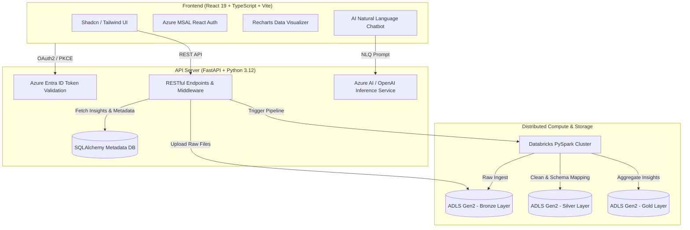

# Hiltend - ETL

[](https://fastapi.tiangolo.com/)
[](https://react.dev/)
[](https://www.typescriptlang.org/)
[](https://azure.microsoft.com/)
[](https://databricks.com/)
[](https://spark.apache.org/)
[](https://tailwindcss.com/)

An enterprise-grade **Cloud Medallion Data Platform** featuring automated data ingestion, Databricks PySpark transformation pipelines, AI-assisted natural language querying (NLQ), dynamic interactive visualizations, and fine-grained Azure Entra ID Role-Based Access Control (RBAC).

---

## Key Features

- **Medallion Architecture Processing**: Streamlined data flow through **Bronze** (raw landing), **Silver** (cleaned/conformed), and **Gold** (aggregated business insights) data layers.
- **Databricks & PySpark Job Orchestration**: High-throughput distributed processing for enterprise schema inference, header extraction, and data transformations.
- **AI-Powered Natural Language Querying (NLQ)**: Integrated Azure AI Inference & OpenAI LLMs enabling users to explore and query complex datasets using plain English.
- **Enterprise Auth & Fine-Grained RBAC**: Azure Entra ID (MSAL PKCE) authentication with granular permissions (`VIEWER`, `USER`, `ADMIN`, `OWNER`) for dataset sharing and dataset collaboration.
- **Dynamic Data Explorer & Visualization Engine**: Real-time SQL-like filtering, custom saved views, column projections, and interactive chart visualization via Recharts.
- **Native Azure Cloud Integration**: Utilizes Azure Data Lake Storage (ADLS Gen2), Azure Key Vault secrets management, and Azure Static Web Apps.

---

## System Architecture & Medallion Data Flow



---

## 📁 Repository Structure

```text
hiltend-etl/
├── hiltend-backend/                # FastAPI Backend Service
│   ├── base/
│   │   ├── api/                    # REST API routes & RBAC dependencies
│   │   ├── core/                   # Security, config & Azure Key Vault integration
│   │   ├── database/               # SQLAlchemy ORM models & session management
│   │   ├── services/               # Databricks orchestrator, ADLS storage & LLM service
│   │   └── spark_jobs/             # Distributed PySpark data processing scripts
│   ├── main.py                     # Application entrypoint & CORS setup
│   ├── pyproject.toml              # Dependencies & Python configuration
│   └── dockerfile                  # Production container definition
│
└── hiltend-frontend/               # React 19 Frontend Application
    ├── src/
    │   ├── components/             # Ingestion, Data Explorer, Visualizer, NLQ & RBAC UI
    │   ├── context/                # MSAL Auth & App State Context
    │   ├── hooks/                  # Custom React hooks
    │   └── lib/                    # Utilities & Axios API Client
    ├── package.json                # Dependencies & Vite configuration
    └── vite.config.ts              # Vite bundle configuration
```

---

## Quick Start Guide

### Prerequisites

- **Python**: `^3.12`
- **Node.js**: `^18.0` or higher
- **Azure Subscription**: Azure Entra ID Tenant & ADLS Gen2 Storage Account
- **Databricks Workspace**: Active Databricks cluster (for distributed ETL processing)

---

### 1. Backend Setup (`hiltend-backend`)

Navigate to the backend directory:
```bash
cd hiltend-backend
```

Create and activate a Python virtual environment:
```bash
python -m venv .venv
source .venv/bin/activate  # On Windows: .venv\Scripts\activate
```

Install dependencies:
```bash
pip install -r requirements.txt
# Or using uv package manager:
uv sync
```

Configure environment variables in `.env`:
```env
AZURE_TENANT_ID=your-tenant-id
AZURE_CLIENT_ID=your-backend-client-id
DATABRICKS_HOST=https://your-databricks-instance.cloud.databricks.com
DATABRICKS_TOKEN=your-databricks-token
AZURE_OPENAI_API_KEY=your-azure-openai-key
```

Run the API service:
```bash
uvicorn main:app --reload --port 8000
```

---

### 2. Frontend Setup (`hiltend-frontend`)

Navigate to the frontend directory:
```bash
cd hiltend-frontend
```

Install dependencies:
```bash
npm install
```

Configure environment variables in `.env`:
```env
VITE_AZURE_CLIENT_ID=your-frontend-client-id
VITE_AZURE_TENANT_ID=your-tenant-id
VITE_API_BASE_URL=http://localhost:8000
```

Launch the Vite development server:
```bash
npm run dev
```

---

## 🛠 Tech Stack Overview

| Domain | Technologies |
| :--- | :--- |
| **Backend API** | FastAPI, Pydantic, SQLAlchemy, Uvicorn |
| **Frontend UI** | React 19, TypeScript, Vite, Tailwind CSS v4, Shadcn UI |
| **Cloud & Security** | Azure Entra ID (MSAL), ADLS Gen2, Azure Key Vault, Azure AI |
| **Data Processing** | Apache Spark, PySpark, Databricks SDK, Python 3.12 |
| **Data Viz & AI** | Recharts, Azure AI Inference / OpenAI |

---

## 📄 License

Distributed under the [MIT License](LICENSE).